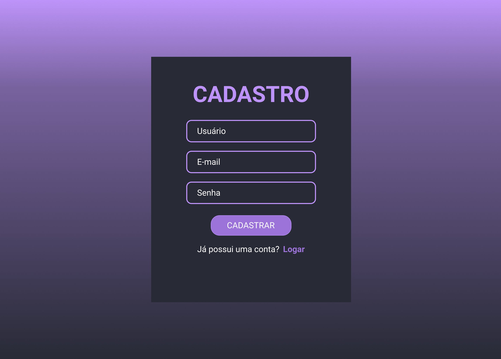
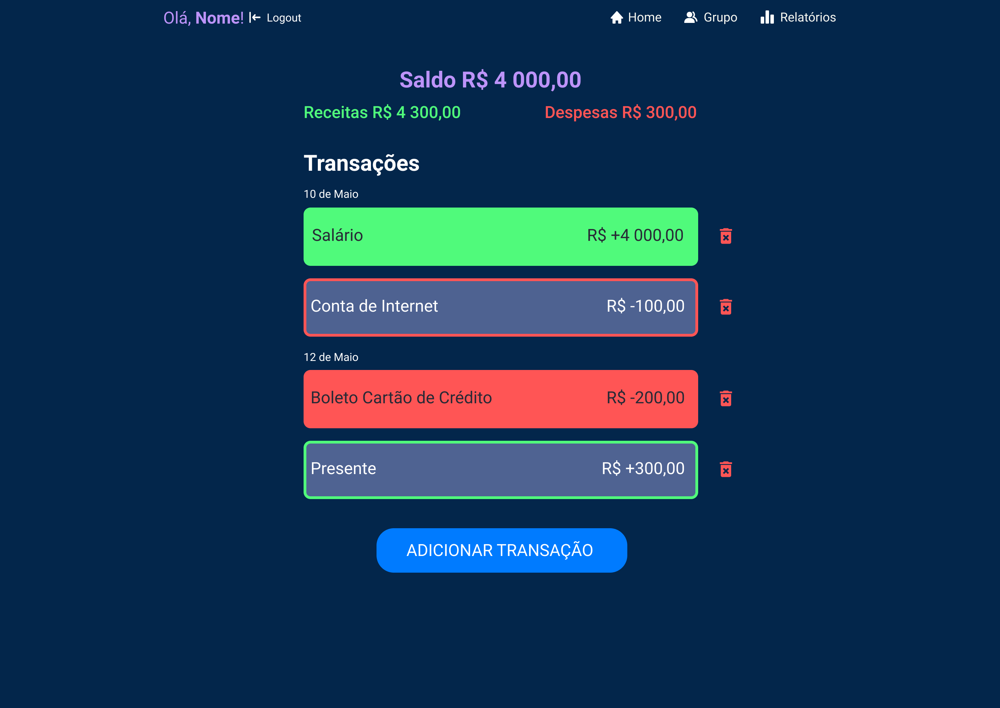

# Sistema de Controle de Gastos Familiar

img src="./img-interfaces/tela-login.png" alt="" width="400"/>

> Status do projeto: em desenvolvimento

## Descrição do projeto
 Tem como objetivo proporcionar de maneira fácil o controle de finanças aos usuários dando uma visão clara dos custos e ganhos, possibilitando que o usúario crie um grupo com os integrantes de sua fámilia para uma visão geral dos custos, e tambem irá gerar relatórios de despesas e receitas do mês e do grupo.
 O sistema será desenvolvido em linguagem Python e utilizará o Banco de Dados SQLite.

## Descrição dos usuários
 Os usuários terão total acesso ao sistema em ambiente online onde eles poderão visualizar suas transações, seu saldo e adicionar novas transações. Os usuários irão informar seu nome, e-mail, salário e seus gastos (ex: conta de luz, internet, compras e entre outros) com isso ele poderá controlar e analisar suas finanças.

## Requisitos Funcionais
**RF001** O sistema deverá fornecer uma tela de cadastro, com campos para pedir o nome, e-mail e uma nova senha do usuário.

**RF002** O sistema deverá fornecer uma tela de login para o usuário acessar sua conta no sistema.

**RF003** O sistema deverá fornecer uma tela inicial exibindo o saldo atual, total de despesas e o total de receitas.

**RF004** O sistema deverá fornecer uma tela para adicionar uma nova transação com os seguintes campos:
* opção para selecionar despesa ou receita
* descrição da transação
* data com dia, mês e ano
* valor da transação
* opção de pago ou não
* selecionar quantos meses de recorrência a transação será efetuada
* botão para salvar a transação

**RF005** O sistema deverá fornecer a exibição das transações em suas respectivas datas, e se já foi pago ou não e o botão para excluir a transação na tela inicial.

**RF006** O sistema deverá fornecer uma tela para criar um novo grupo com outros usuários, com campos para definir o nome e a descrição do grupo, e gerar um id único para outros usuários entrar.

**RF007** O sistema deverá fornecer uma opção para o usuário entrar em um grupo existente informando o id do grupo que deseja participar.

**RF008** O sistema deverá fornecer um botão para exclusivamente ao administrador editar o nome, a descrição e remover integrantes do grupo. 

**RF009** O sistema deverá fornecer relatórios com gráficos em porcentagem e em forma de pizza para os seguintes itens:
* receitas x despesas
* despesas por mês
* receitas por mês
* despesas do grupo familiar
* receitas do grupo familiar

## REQUISITOS NÃO FUNCIONAIS
**RNF001** Linguagem de programação utilizada será Python com o Django

**RNF002** O SGBD utilizado será o SQLite

## INICIAR O PROJETO
Instalar todos os pacotes necessários do projeto
pip install -r requirements.txt

Rodar o servidor da aplicação
python manage.py runserver
